# U-Speak STEM

**本物の物理と本物の宇宙のデータで、歩いて入れる科学の世界。**
子どもは島を歩き、予想して、実験して、測って、**英語で**説明する。
結果はサーバーが同じ物理でもう一度計算して確かめる。

**見た目は U-Speak Web と同じ。** 島の部品（`client/island-kit.js`）は英語版からそのまま持ってきたもので、
段々のボクセルの島・桟橋・名前の札がかかった家・街灯・クリーム色の HUD・左のノート・右の地図とレール、
すべて英語版の子どもが知っている形で出る。

| | |
|---|---|
| 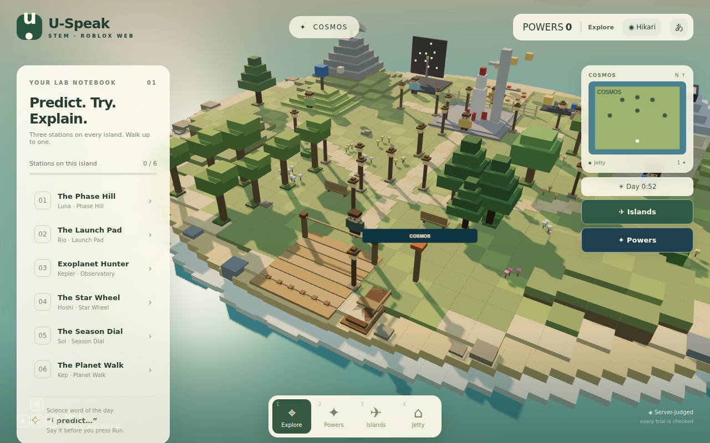 | 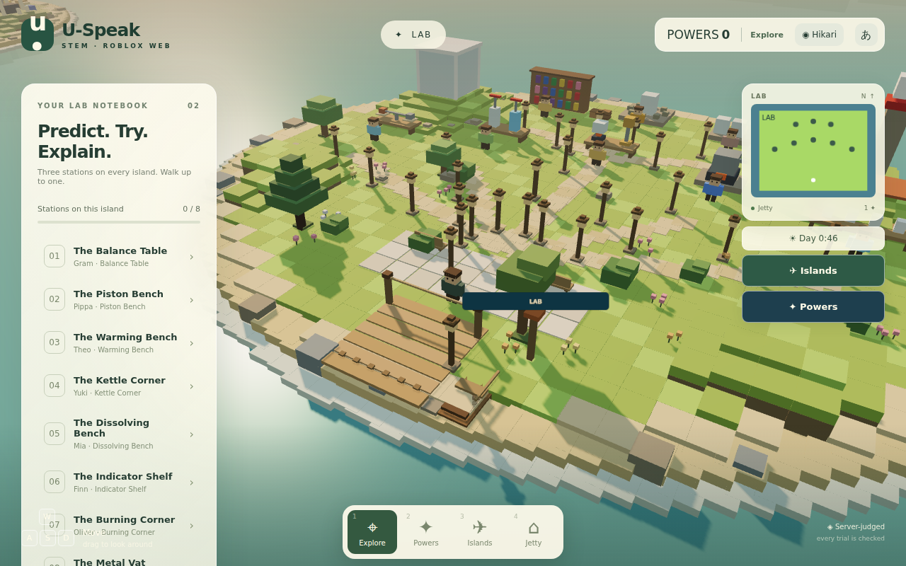 |
| 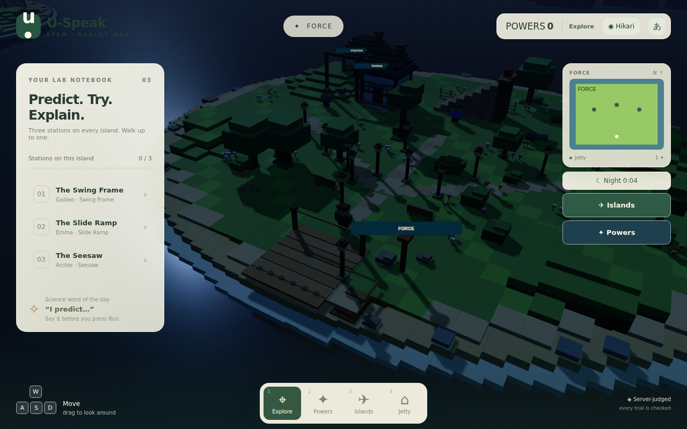 | 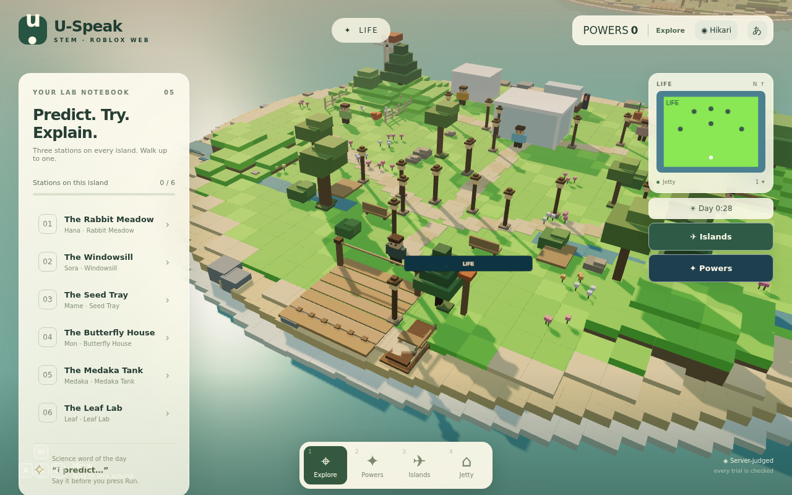 |
| 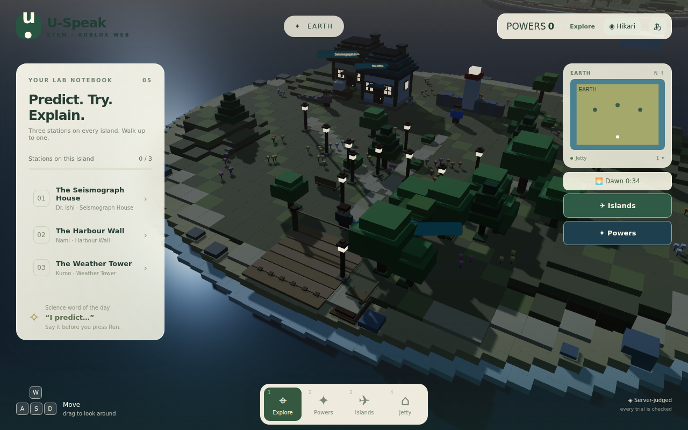 | 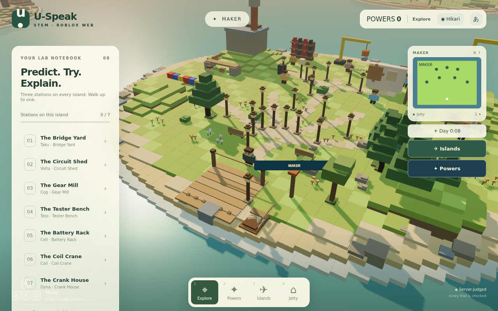 |
| 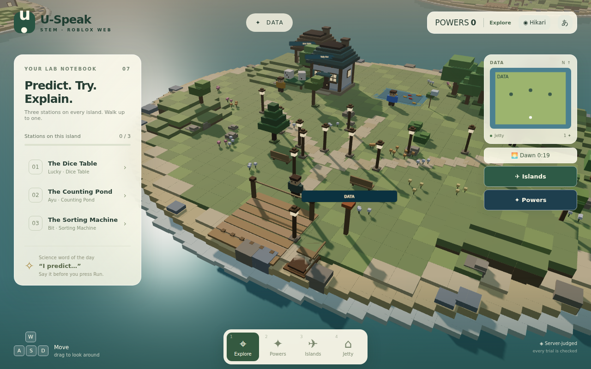 | |

**世界には時計がある**（`client/world-clock.js`）。英語版と同じ 705 秒の1日（昼 300・夕 120・夜 240・朝 45）。
壁時計の純粋関数なので、どのクラスのどの子も同じ空を見る。夜は月が出て、街灯がつき、天文台が本領を出す。

## 7つの島と 21 の実験

| 島 | 場所 | 実験 | 中身 |
|---|---|---|---|
| **COSMOS**（そらの しま） | つきの おか | 月の満ち欠け（小4・小6） | 本物の月齢。太陽・地球・月の角度 → 見える形 |
| | うちあげだい | 軌道の発射台（中3） | ニュートン重力・ベロシティ・ベルレ積分。ISS の周期92分、静止軌道42,164 km が出る |
| | てんもんだい | 系外惑星ハンター | トランジット。TRAPPIST-1 b など本物の4惑星のパラメーター |
| **LAB**（かがくの しま） | とかす だい | もののとけ方（小5・中1） | 本物の溶解度の表（しお・さとう・ミョウバン・ホウさん・硝酸カリウム）。温度を変えて、とける限り → 再結晶 |
| | しらべる たな | 酸とアルカリ（小6・中3） | 身近な15の液体の pH と、4つの指示薬（リトマス・BTB・むらさきキャベツ・フェノールフタレイン）の色 |
| | もえる コーナー | 燃焼のしくみ（小6・中1） | びんの大きさ・酸素の割合・ろうそくの数 → 消えるまでの秒、できた二酸化炭素、石灰水 |
| **FORCE**（ちからの しま） | ふりこの わく | ふりこ（小5） | T = 2π√(L/g)。おもりの重さは関係ない、ひもの長さだけ |
| | すべりだい | さかと まさつ（中3） | 氷・木・ゴムの摩擦係数。tanθ > μ で動き出す。加速度と下での速さ |
| | シーソー | てこ（小6） | モーメントのつりあい。2 kg の子が 10 kg を持ち上げる距離 |
| **LIFE**（いのちの しま） | ウサギの はらっぱ | ウサギと キツネ（中3） | ロトカ＝ヴォルテラ。120日で両方生きるか、どちらかが消えるか。周期 |
| | まどべ | まめを そだてる（小3・小5） | 水・光・温度 → 14日後の高さと葉。水は多すぎても枯れる |
| | はしる コース | しんぞうと うんどう（小6） | 運動の強さと時間 → 心拍・呼吸・落ち着くまでの秒 |
| **EARTH**（ちきゅうの しま） | じしんけいの いえ | じしんの なみ（中1） | P 波 6 km/s・S 波 3.5 km/s。初期微動継続時間 × 8.4 ≒ 震源距離 |
| | みなとの かべ | つなみ（中1） | √(g·h)。深い海ほど速く、岸で高くなる。到達までの分 |
| | てんきの とう | くもと あめ（小5） | 露点（Magnus 式）→ 雲底の高さ。湿度 100% で地面に霧 |
| **MAKER**（つくる しま） | はしの こうば | はしの つよさ（中3） | はりのたわみ ∝ L³/t³。厚さ2倍で8倍かたい。材料の限界応力 |
| | かいろの こや | でんきの かいろ（中2） | オームの法則。20 mA に合う抵抗。切れる電流 |
| | はぐるまの こや | はぐるま（小5） | 歯の比 → 回転数・向き・力の倍率 |
| **DATA**（データの しま） | サイコロの テーブル | サイコロと かくりつ（小6・中2） | 種つきの乱数。2個の和は 7 が最頻。ヒストグラム |
| | かぞえる いけ | 見えない さかなを かぞえる（中3） | 標識再捕獲法（リンカーン＝ピーターセン）。推定と本当の数の誤差 |
| | しわけ マシン | AI の しわけ（小6〜） | k 近傍法。重さと色でりんご／みかん。k を変えると精度が変わる |

**1つの実験に3つの深さ**（Explore 4〜7 / Investigate 8〜11 / Engineer 12〜15）。深さは先生が決める。

**実験はすべて 3D**（`client/stage.js`・`stage-more.js`、見た目の部品は `stage-look.js`）。パネルの中に three.js の舞台があり、指で回せる。
影が落ち、空はドーム、床には光だまり、炎や星はにじみ、粒が漂う。入ると少し引いた位置から寄り、放っておくとゆっくり首をふる。
惑星・月・太陽・木目・石・サイコロの目は全部その場で描いたテクスチャ（画像ファイルなし）。

| | |
|---|---|
| 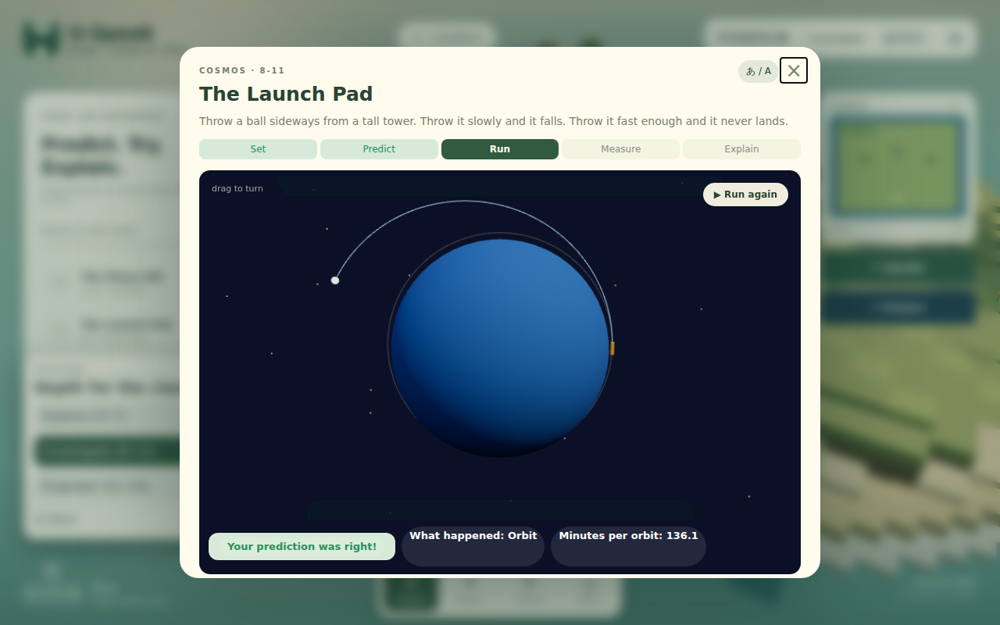 | 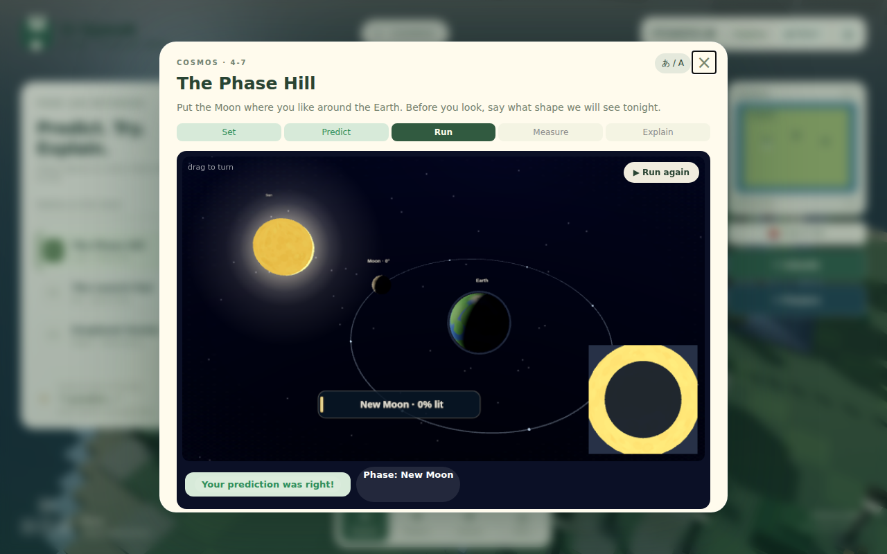 |
| 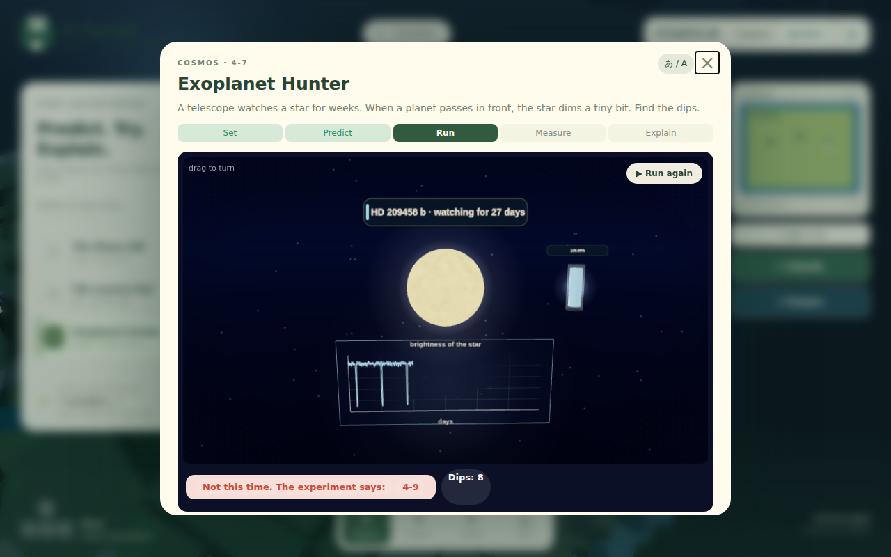 | 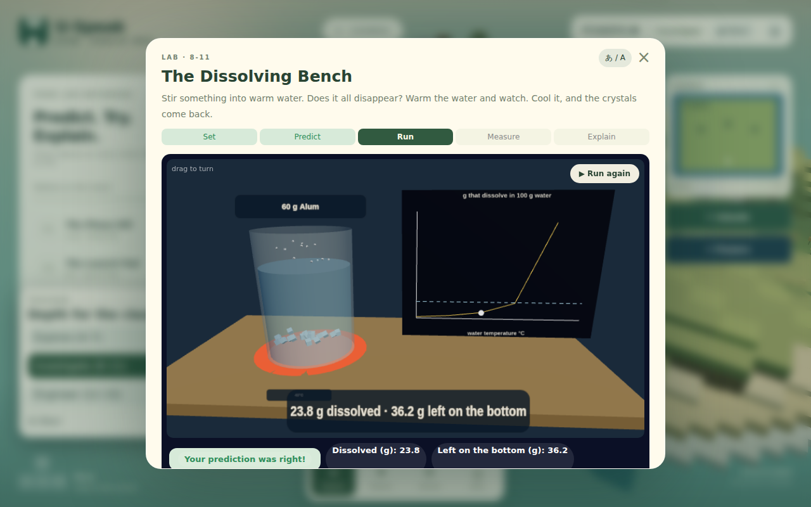 |
| 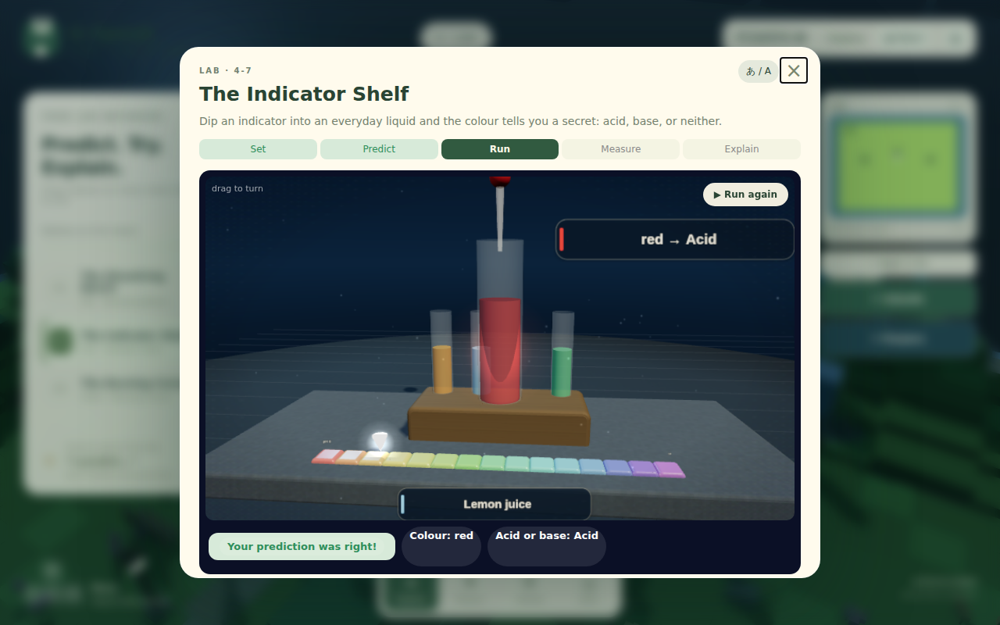 | 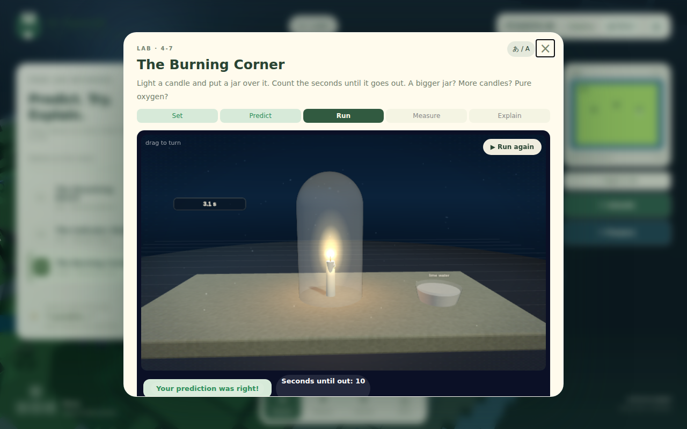 |
| 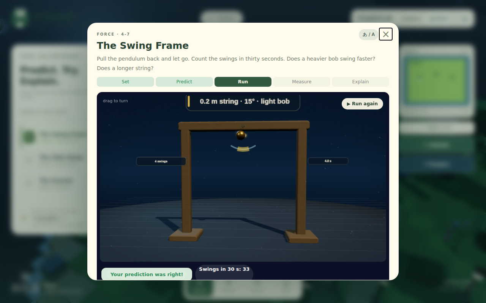 | 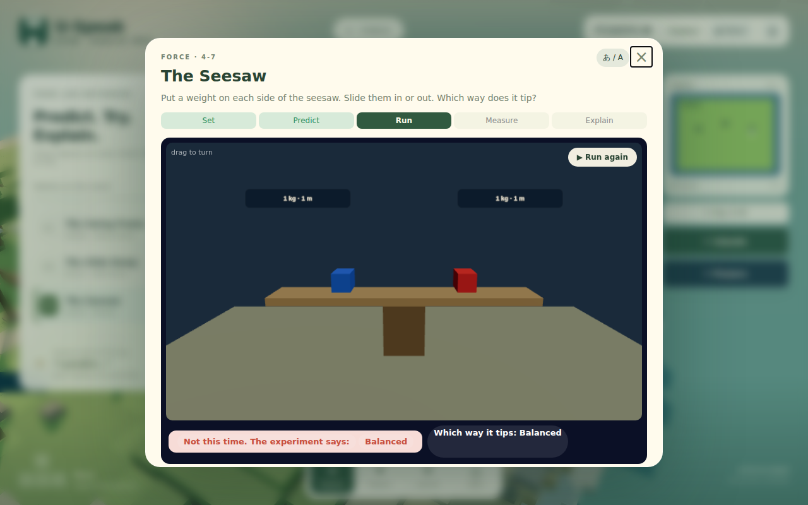 |
| 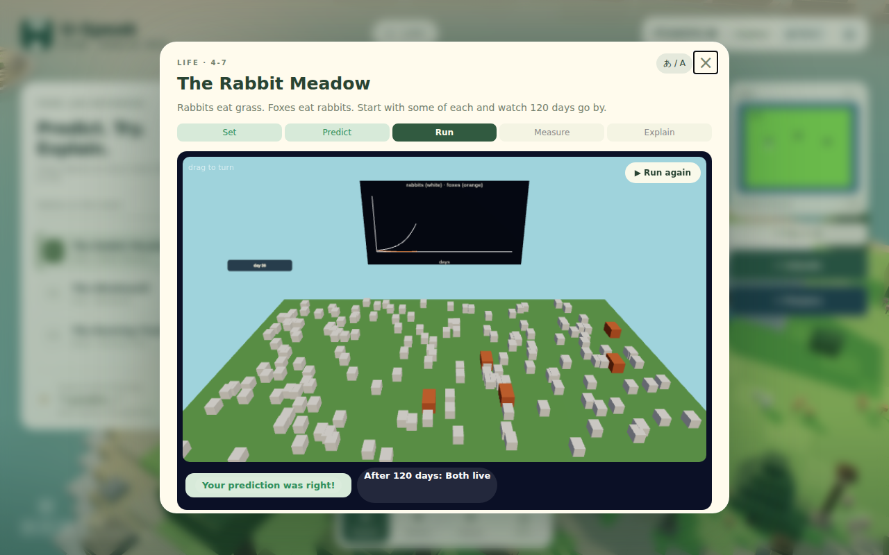 | 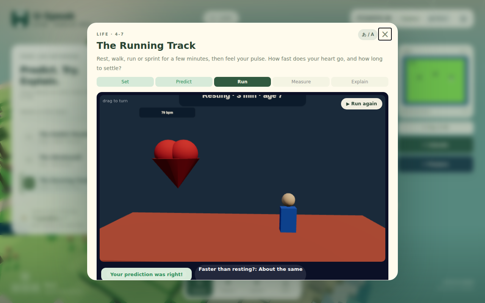 |
| 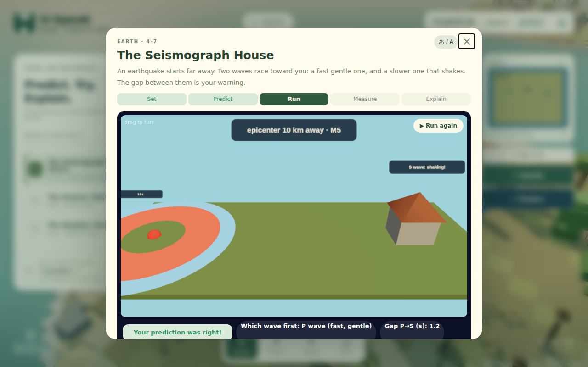 | 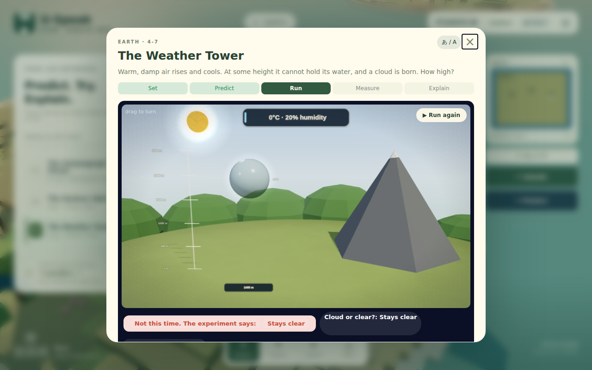 |
| 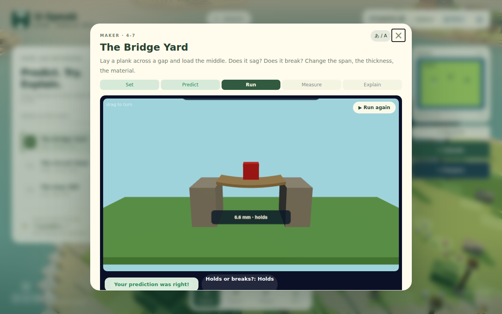 | 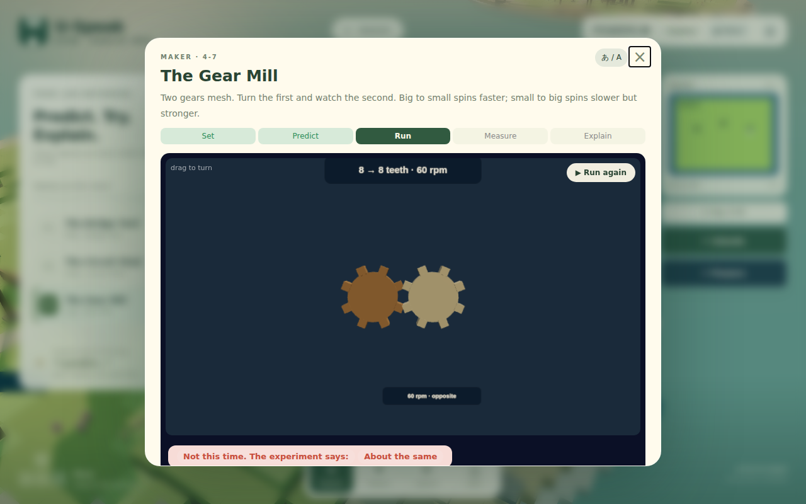 |
| 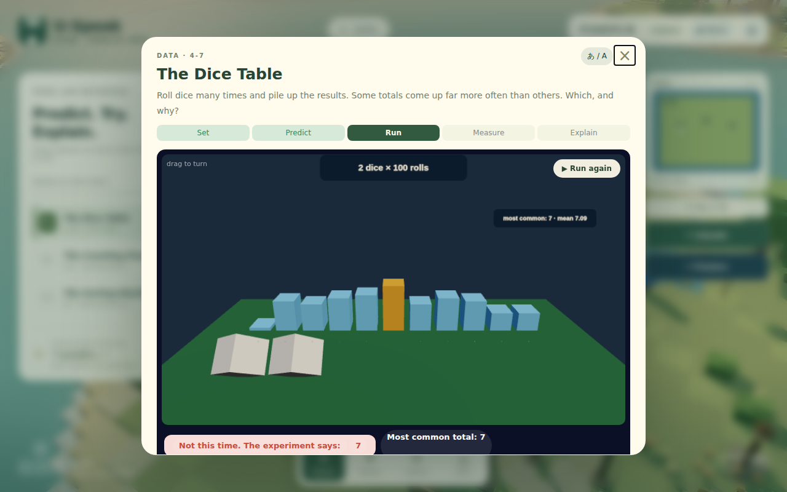 | 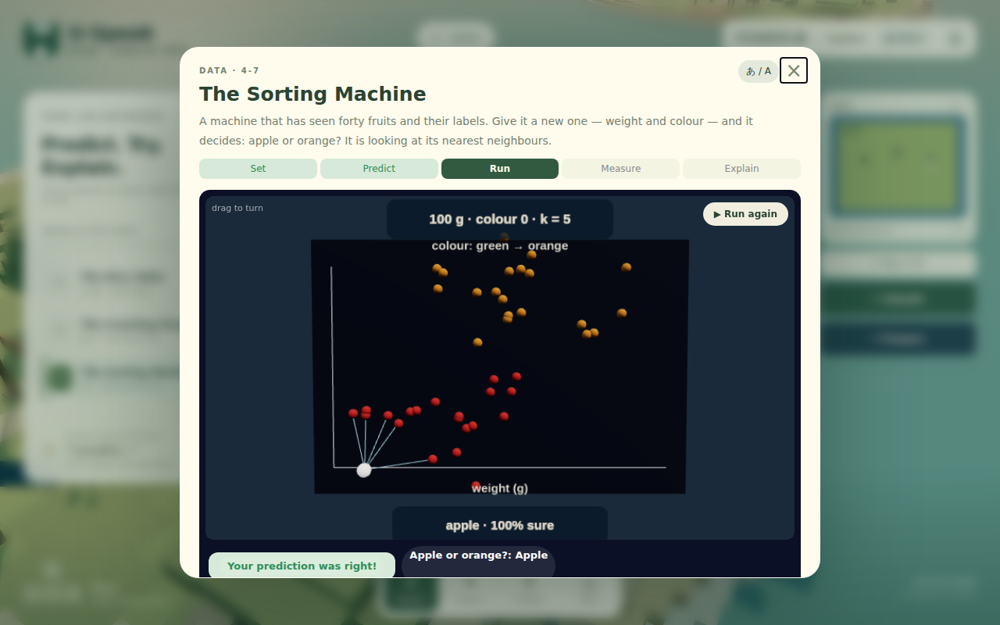 |

- 軌道：ボールが本物の軌道（サーバーが計算した点）の上を飛ぶ。
- 月：太陽の光で月が本当に欠ける。右下の小さな窓は「地球から見た月」を、地球に置いたカメラで描いたもの。
- 系外惑星：惑星が星の前を横切るたびに、明るさのメーターと光度曲線が落ちる。
- とける：結晶が水に消え、とけ残りが底にたまる。横の板に溶解度曲線とこの実験の点。
- 酸とアルカリ：スポイトが1滴落として、試験管の色が変わる。pH の目盛りに印が立つ。
- ろうそく：びんがかぶさり、タイマーが進み、炎が小さくなって消える。石灰水が白くにごる。

**舞台は結果を計算しない。** 部屋が送った結果（予想のあと）を描くだけなので、覗き見はできない。

設計書は `docs/uspeak-stem-design.md`、市場は `docs/uspeak-stem-market.md`。

## 動かす

```sh
cd server && npm install
npm start                    # http://localhost:2568
TEACHER_KEY=xxxx npm start   # 先生キーを決めると、先生コンソールが開く
```

ブラウザで開き、名前とクラスのコードを入れる。同じコードの子が同じ島に入る。
右の「✈ Islands」か ホットバーの 3 で、7つの島を行き来する。右のレールの時計が、いまの空（昼・夕・夜・朝）と残り時間。

## しくみ（ここだけ守ること）

1. **`shared/` はブラウザとサーバーが同じファイルを読む。** 物理と化学（`shared/sim`）と実験の定義（`shared/experiments`）。
   純粋関数だけ。時計・乱数・DOM を読む関数はここに置かない。乱数は `rng(seed)` から。
2. **結果は、予想を送ったあとにしか来ない。** `lab:start` → `lab:ready`（結果なし）→ `lab:predict` → `lab:result`。
   予想は結果より先に保存され、あとから変えられない。これが「シミュレーション」を「実験」にする1つの規則。
3. **測ったものはサーバーが再計算して比べる。** ページが報告した値がサーバーの値と合わなければ、点にならない。
4. **深さ（explore / investigate / engineer）は先生が決める。** ページが送っても無視される。
5. **英語の説明は aims（キーワードの組）で判定する。** 英語版の台本モードと同じ作り。あとで AI に置き換えられる。
6. **画面は英語が主、「あ」で日本語。** 文字は `<b class="en">` / `<i class="ja">` で両方書く。学習の中身は訳さない。
7. **島は `island-kit.js` で建てる。** 英語版の `createIsland({scene, build})` そのもの。建物の名前は `{en, ja}` で渡す。

## 検査

```sh
cd server
npm test            # 物理・化学・力・生命・地球・工作・データ（教科書の値と一致）・判定・部屋（実ソケットで順番と先生の権限）— 21件
npm run test:e2e    # 実ブラウザ：2人で入り、先生が深さを変え、COSMOS で予想→実行→測定→説明→クラスのデータ→言語切替、LAB へ飛んで とかす実験、島の看板、実験が 3D（WebGL）であること、残り5島の15の実験すべてで 3D の舞台が動きサーバーの判定が返ること、世界の時計 — 35項目
```

## 足すとき

- **実験を足す**：`shared/experiments/*.json` を書き、`index.js` に import を1行。壊れていれば起動時に落ちる。
- **物理を足す**：`shared/sim/` にモジュールを足し、`run.js` の `switch` に1つ。
- **島を足す**：`client/islands.json` に1つ、`client/islands-build.js` の `BUILDERS` に `build` 関数を1つ。`REGIONS`（`shared/experiments/index.js`）に1行。
- **3D の舞台を足す**：`client/stage-more.js` に builder を1つ（`sim` の名前で）。

## データのライセンス

いま使っているのは、自分で計算した物理と、公開されている惑星のパラメーター・溶解度・pH の表だけ。
画像・星表を足すときは `docs/uspeak-stem-design.md` §11 の表に従う（NASA・ESA/Webb・PhET・SDSS は表記を守れば可。Gaia は許諾が要る）。
